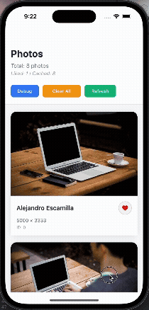
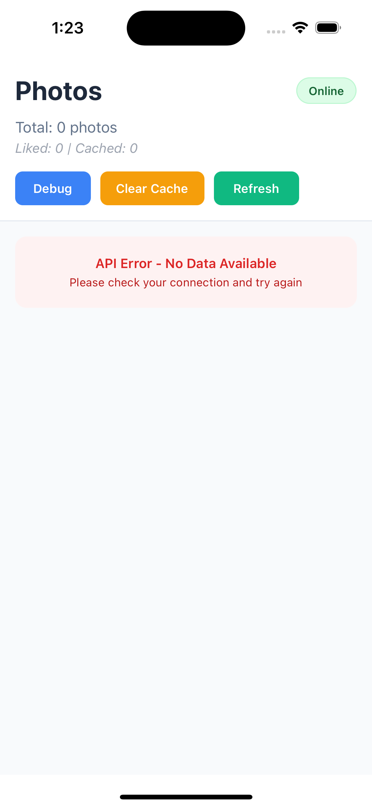
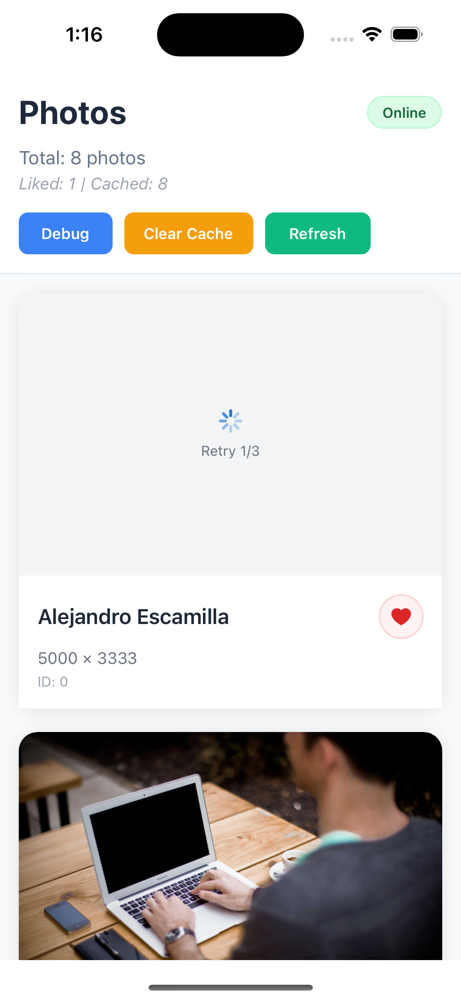
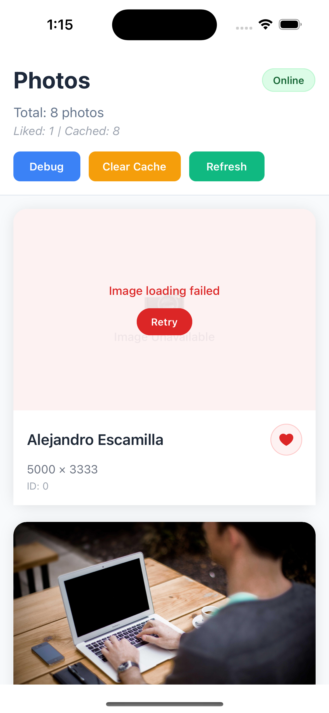

# ShoutPhotoLikeChallenge

A React Native photo gallery app with like functionality, built with Redux Toolkit and Redux Saga.

## Demo



## State Management

This project uses a hybrid approach with both Redux Toolkit and Redux Saga for state management.

### Redux Toolkit Workflow (Current)

```
Component → useImageState Hook → Redux Toolkit Slice → API Service → State Update
```

**Key Features:**
- **Async Thunks**: `fetchAllPhotos`, `togglePhotoLike`
- **Automatic State Management**: Loading, success, error states
- **Modern Redux**: Immer for immutable updates, createSlice for reducers
- **Type Safety**: Full TypeScript support

**Usage Example:**
```typescript
import { useImageState } from '@/redux';

const MyComponent = () => {
  const { photos, isLoading, actions } = useImageState();
  
  const handleFetch = () => {
    actions.fetchAllPhotos(1, 8); // page 1, 8 photos
  };
  
  const handleLike = (photoId, author, currentStatus) => {
    actions.togglePhotoLike(photoId, author, !currentStatus);
  };
};
```

### Redux Saga Workflow (Legacy)

```
Component → Action → Saga → API Service → Action → Reducer → State Update
```

**Key Features:**
- **Side Effect Management**: Complex async operations
- **Action Interception**: Watches for specific actions
- **Error Handling**: Centralized error management
- **Backward Compatibility**: Existing functionality preserved

**Usage Example:**
```typescript
import { getAllPhoto } from '@/redux/actions/get-all-photo-action';

const MyComponent = () => {
  const dispatch = useDispatch();
  
  const handleFetch = () => {
    dispatch(getAllPhoto(1, 8)); // Triggers saga
  };
};
```

## Error Handling

The app gracefully handles various error scenarios:





## Project Structure

```
src/
├── redux/
│   ├── slices/          # Redux Toolkit slices
│   ├── saga/            # Redux Saga files
│   ├── actions/         # Action creators
│   ├── reducers/        # Traditional reducers
│   ├── selectors/       # State selectors
│   └── hooks/           # Custom hooks
├── services/            # API services
├── components/          # UI components
└── screens/             # App screens
```

## Getting Started

### Prerequisites
- Node.js >= 18
- React Native CLI
- Android Studio / Xcode

### Installation
```bash
npm install
# or
yarn install
```

### Running the App
```bash
# Start Metro bundler
npm start

# Run on Android
npm run android

# Run on iOS
npm run ios
```

## Features

- **Photo Gallery**: Fetch and display photos from API
- **Like System**: Toggle photo likes with local storage
- **Pagination**: Infinite scroll with page-based loading
- **Caching**: Local storage for photos and likes
- **State Management**: Redux Toolkit + Saga hybrid approach
- **Cross Platform**: Works on both Android and iOS

## API

- **Base URL**: `https://picsum.photos/v2`
- **Endpoint**: `/list?page={page}&limit={limit}`
- **Photos per page**: 8

## Development

### Adding New Features
1. **Redux Toolkit (Recommended)**: Use `useImageState` hook and slice actions
2. **Redux Saga**: For complex side effects or existing patterns

### State Updates
- **Photos**: Managed by `imageSlice` with async thunks
- **Likes**: Local storage with Redux state synchronization
- **Pagination**: Automatic page management and infinite scroll

## Contributing

1. Fork the repository
2. Create a feature branch
3. Commit your changes
4. Push to the branch
5. Create a Pull Request

## License

This project is licensed under the MIT License.
